# Load Cell Transducer Signal Conditioning Circuit ⚖️📊

A complete signal conditioning circuit design for load cell transducers, featuring amplification and filtering to convert mechanical force into accurate digital measurements. This project includes circuit design, simulation, hardware implementation, and Arduino integration for weight measurement applications.

[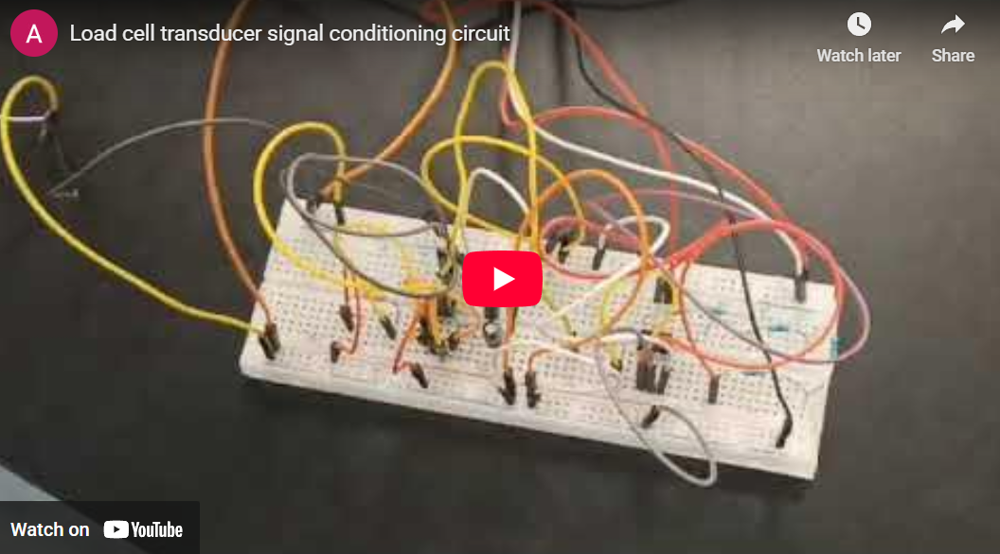](https://www.youtube.com/embed/DgbXGMnuxDU?si=gRIlU-lQ4G0Qo942)

## 📋 Description

A load cell transducer is a sensor that converts mechanical forces or loads into electrical signals. This project demonstrates the complete design and implementation of a signal conditioning circuit that processes the raw signal from a strain gauge load cell through filtering and amplification stages, ultimately providing accurate weight measurements through Arduino integration.

The circuit employs an active low-pass filter combined with amplification to process the millivolt-level signals from the load cell's Wheatstone bridge configuration into usable voltage levels for microcontroller processing.

<br>
<div align="center">
  <a href="https://load-cell-transducer-signal-conditioning-circuit.streamlit.app/">
    
  </a>
</div>
<br>
<div align="center">
  <a href="https://codeload.github.com/TendoPain18/load-cell-transducer-signal-conditioning-circuit/legacy.zip/main">
    
  </a>
</div>


## 🎯 Project Objectives

1. **Design a signal conditioning circuit** for load cell sensors
2. **Implement active low-pass filtering** to remove high-frequency noise
3. **Amplify the signal** to usable voltage levels (Gain = 150)
4. **Integrate with Arduino** for digital weight measurement
5. **Validate design** through simulation and hardware testing

## ✨ Features

- **Active Low-Pass Filter**: Removes high-frequency noise with cutoff frequency of 25 rad/sec
- **High Gain Amplification**: 150x amplification using operational amplifiers
- **Real-Time Signal Processing**: Analog Discovery 2 for signal acquisition and analysis
- **Arduino Integration**: Digital weight measurement and display
- **Complete Workflow**: From raw signal acquisition to final weight reading
- **Multiple Design Tools**: LTSpice simulation, Proteus 8 modeling, and hardware implementation

## 📊 System Architecture

### Block Diagram
```
┌─────────────┐      ┌──────────────┐      ┌───────────┐      ┌─────────────┐
│  Load Cell  │─────▶│  Low-Pass    │─────▶│ Amplifier │─────▶│   Arduino   │
│   Sensor    │      │    Filter    │      │ (G = 150) │      │   (A/D)     │
└─────────────┘      └──────────────┘      └───────────┘      └─────────────┘
```

**Signal Flow:**
1. **Load Cell Sensor**: Generates millivolt-level signal proportional to applied force
2. **Low-Pass Filter**: Attenuates frequencies above 25 rad/sec cutoff
3. **Amplifier**: Amplifies filtered signal by 150x for Arduino ADC range
4. **Arduino**: Converts analog signal to digital weight measurement

## 🔬 Load Cell Fundamentals

### Working Principle

Load cells operate based on **strain gauge technology** arranged in a **Wheatstone bridge configuration**. When force is applied, the strain gauges experience resistance changes that create an imbalanced bridge, producing an output voltage.

**Output Voltage Formula:**
```
V_out = V_exc × G × (ΔR / R)
```

Where:
- `V_out` = Output voltage of the load cell
- `V_exc` = Excitation voltage applied to the bridge
- `G` = Gain or sensitivity of the load cell
- `ΔR` = Change in resistance due to applied force
- `R` = Initial (unstrained) resistance of strain gauges

### Types of Load Cells

| Type | Design | Applications |
|------|--------|--------------|
| **Compression** | Cylindrical/block-shaped | Industrial presses, tank weighing |
| **Tension** | Elongated design | Crane scales, tensile testing |
| **Shear** | Compact, low-profile | Material testing, limited spaces |
| **Bending Beam** | Simple bending elements | Platform scales, hopper weighing |
| **S-Beam** | S-shaped structure | Tension/compression testing |
| **Canister** | Cylindrical, high-capacity | Heavy industrial equipment |

## 🛠️ Circuit Design

### Design Specifications

**Filter Stage:**
- **Type**: Active Low-Pass Filter (1st order)
- **Cutoff Frequency**: ω_c = 25 rad/sec (≈ 4 Hz)
- **Components**:
  - R_i1 = 33 kΩ (Input resistor)
  - R_f1 = 33 kΩ (Feedback resistor)
  - C_f = 1 / (ω × R_f1) = 1 / (25 × 33000) ≈ 1.21 μF

**Amplifier Stage:**
- **Type**: Inverting Op-Amp Configuration
- **Gain**: G = 150
- **Components**:
  - R_i2 = 33 kΩ (Input resistor)
  - R_f2 = 4.95 MΩ (Feedback resistor)
  - Gain Formula: G = 1 + (R_f2 / R_i2) = 1 + (4.95M / 33k) ≈ 150

### Component Selection

All components were chosen based on availability in the lab:
```
Filter Stage:
├── R_i1: 33 kΩ
├── R_f1: 33 kΩ
└── C_f: 1.21 μF (calculated)

Amplifier Stage:
├── R_i2: 33 kΩ
└── R_f2: 4.95 MΩ

Op-Amps: Standard (e.g., LM358, TL082)
Power Supply: ±5V to ±15V
```

## 📐 Design Process

### Stage 1: Signal Acquisition

**Using Analog Discovery 2:**

1. **Connection**
   - Connect load cell output to Analog Discovery 2 analog input channels
   - Ensure proper grounding and shielding

2. **Waveforms Software Setup**
   - Launch Digilent Waveforms software
   - Select Scope instrument
   - Configure voltage range and time scale
   - Start data acquisition

3. **Data Export**
   - Export raw signal data with/without headers
   - Prepare data for LTSpice import

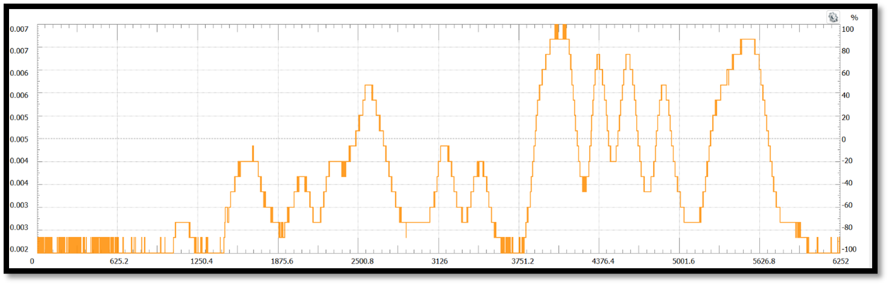

### Stage 2: Signal Analysis

**Frequency Domain Analysis:**
- Performed Fourier analysis to convert time domain to frequency domain
- Identified noise components in higher frequencies
- Determined optimal cutoff frequency: **25 rad/sec**

**Interactive Simulator:**

Try our [**Interactive Filter Simulator**](https://load-cell-transducer-signal-conditioning-circuit.streamlit.app/) to visualize how different cutoff frequencies affect the signal output in real-time!

[](https://load-cell-transducer-signal-conditioning-circuit.streamlit.app/)

**Features:**
- Upload custom CSV files or use default signal data
- Adjust cutoff frequency (Wc) with interactive slider
- Real-time visualization of input vs filtered output
- Configurable Wc range for detailed analysis

### Stage 3: LTSpice Simulation

**Circuit Implementation:**
- Imported raw signal from Analog Discovery 2
- Designed two-stage circuit (filter + amplifier)
- Simulated circuit response

**Results:**
- **Green signal**: Raw input from load cell
- **Blue signal**: Filtered and amplified output
- Significant noise reduction achieved
- Output amplitude increased by 150x

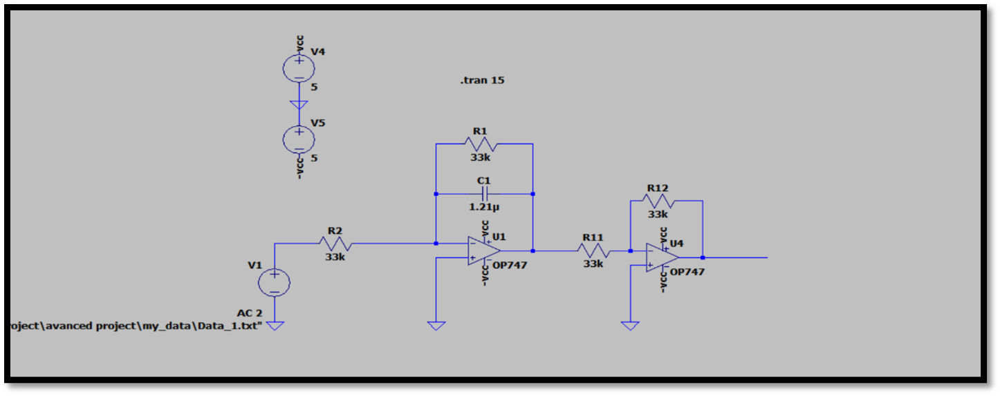

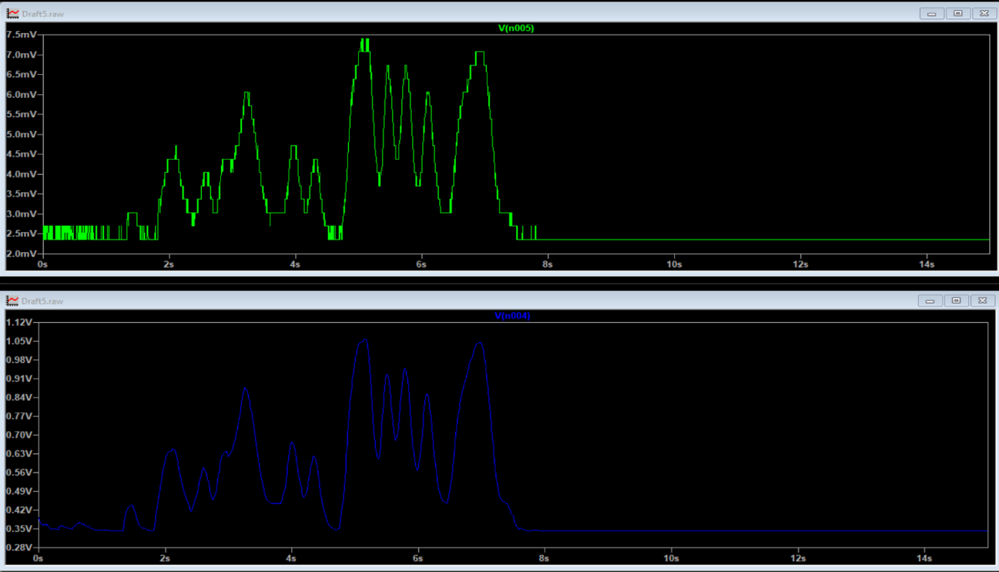

*LTSpice simulation showing input (green) and filtered/amplified output (blue)*

### Stage 4: Proteus 8 Simulation

**Arduino Integration:**
- Designed complete circuit with Arduino Uno in Proteus 8
- Connected filter/amplifier output to Arduino A0 (analog input)
- Programmed Arduino to read ADC values and calculate weight

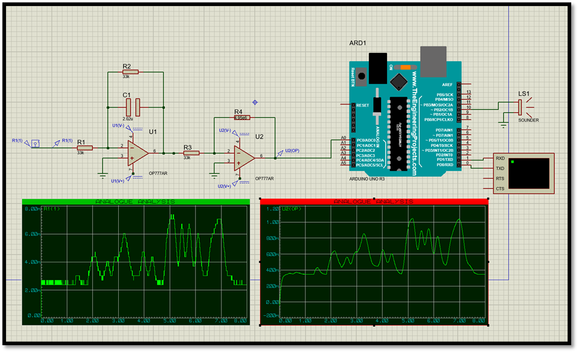

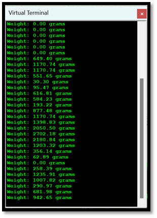

*Proteus 8 simulation with Arduino integration*

### Stage 5: Hardware Implementation

**Physical Circuit:**
- Designed initial layout in TinkerCAD
- Implemented on breadboard with clean wiring
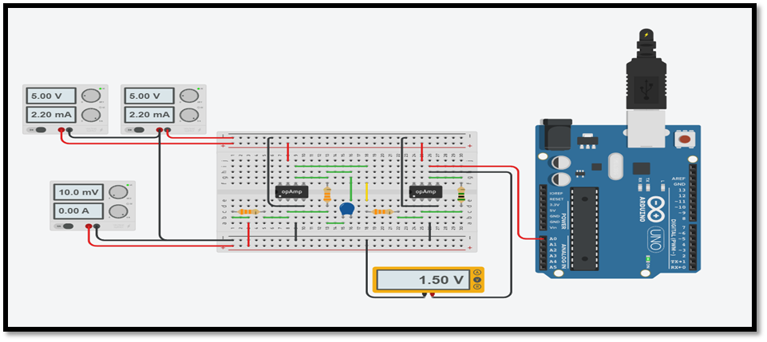

**Hardware Photos:**

<div align="center">
  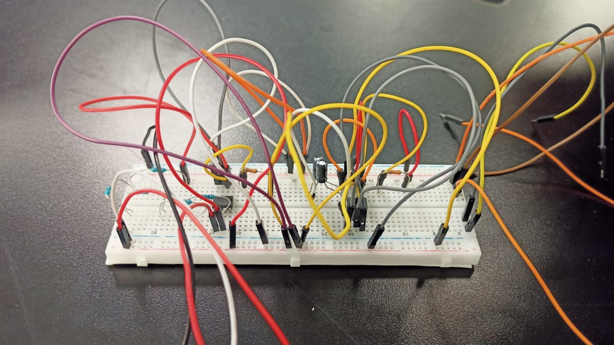
  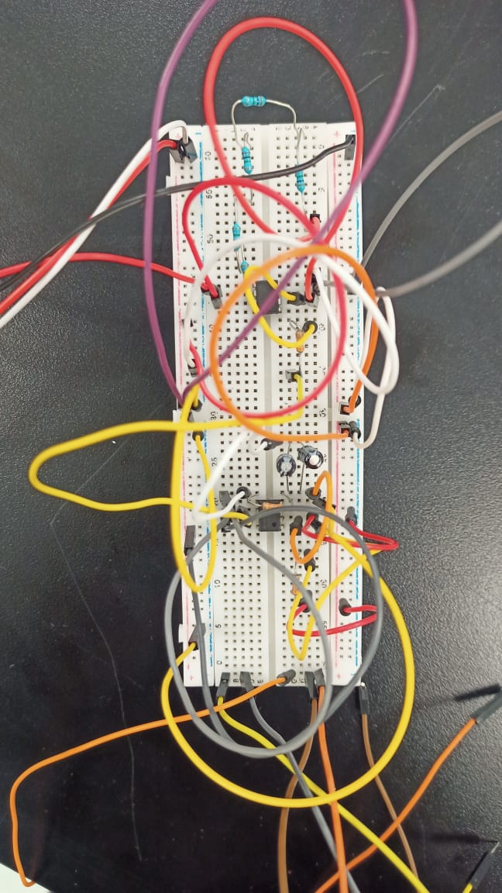
</div>

<div align="center">
  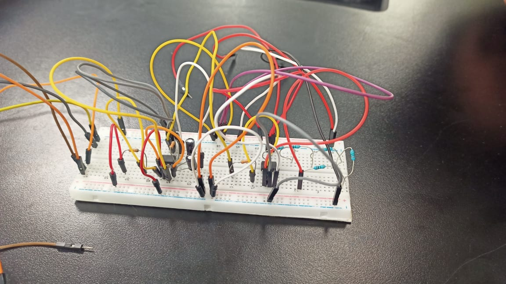
  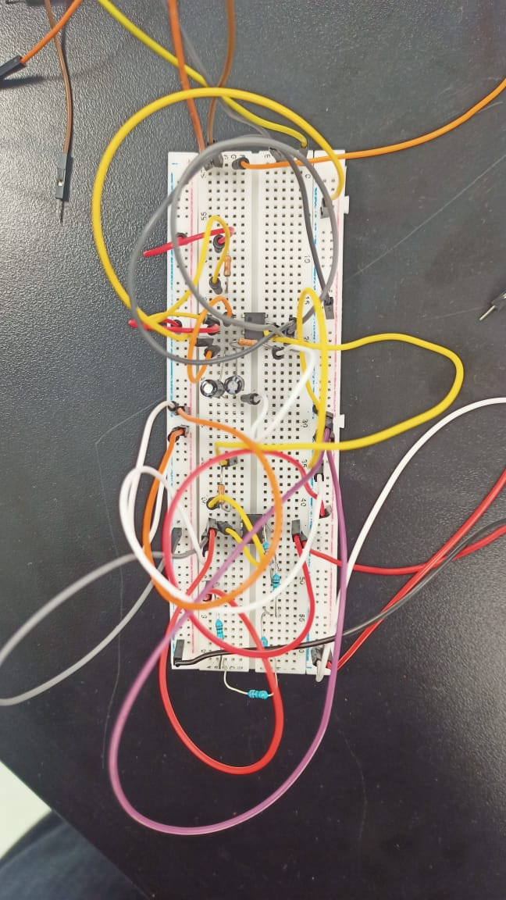
</div>

*Complete hardware implementation on breadboard*

## 💻 Arduino Implementation

### Weight Measurement Algorithm

The Arduino code reads the analog voltage from the signal conditioning circuit and converts it to weight measurements in grams.

**Key Features:**
- Offset calibration for zero-point reference
- Real-time ADC reading from A0 pin
- Linear conversion formula for weight calculation
- Negative value protection
- Serial output for monitoring (100ms update rate)

**Calibration Process:**

1. **Zero Calibration**: Record ADC reading with no load (offset = 100)
2. **Scale Calibration**: Apply known weight and adjust scaling factor
3. **Verification**: Test with multiple known weights for linearity

**Weight Calculation Formula:**
```
weight = 10 × ((rawValue - offset) / (1024 - offset))
```

Where:
- `rawValue`: ADC reading (0-1023)
- `offset`: Zero-point calibration value (100)
- `10`: Scaling factor for weight range
- Result in grams

## 🚀 Getting Started

### Prerequisites

**Hardware:**
- Load cell sensor (e.g., 10kg strain gauge load cell)
- Analog Discovery 2 (signal acquisition)
- Operational amplifiers (LM358, TL082, or similar)
- Resistors: 33kΩ (3×), 4.95MΩ (1×)
- Capacitor: 1.21μF
- Arduino Uno
- Breadboard and jumper wires
- Power supply (±12V recommended)

**Software:**
- Digilent Waveforms (Analog Discovery 2)
- LTSpice XVII (circuit simulation)
- Proteus 8 Professional (Arduino simulation)
- Arduino IDE (programming)
- MATLAB (optional, for analysis)

### Installation & Setup

1. **Clone the repository**
```bash
git clone https://github.com/yourusername/load-cell-transducer.git
cd load-cell-transducer
```

2. **Acquire Raw Signal**
   - Connect load cell to Analog Discovery 2
   - Launch Waveforms software
   - Acquire and export raw signal data

3. **Simulate in LTSpice**
   - Open `LtSpice.asc`
   - Import raw signal data
   - Run simulation

4. **Build Hardware Circuit**
   - Follow circuit schematic
   - Use breadboard for prototyping
   - Apply ±12V power supply

5. **Program Arduino**
   - Open `load_cell.ino` in Arduino IDE
   - Upload to Arduino Uno
   - Open Serial Monitor to view weight readings

## 🧪 Testing & Calibration

### Performance Metrics

| Parameter | Specification | Measured |
|-----------|--------------|----------|
| Cutoff Frequency | 25 rad/sec (4 Hz) | ≈ 4 Hz |
| Voltage Gain | 150 | ~150 |

### Testing Procedure

1. **Zero Test**: Verify output with no load
2. **Known Weight Test**: Apply calibrated weights (1g, 5g, 10g)
3. **Repeatability Test**: Multiple measurements of same weight
4. **Noise Test**: Measure signal stability over time
5. **Range Test**: Test from minimum to maximum load capacity

### Arduino Serial Monitor Output

Expected readings when monitoring weight:
```
Weight: 0.00 grams
Weight: 2.34 grams
Weight: 5.67 grams
Weight: 8.91 grams
```

## 🎓 Learning Outcomes

This project demonstrates:

1. **Analog Signal Processing**: Filtering and amplification techniques
2. **Sensor Integration**: Working with strain gauge load cells
3. **Circuit Design**: Active filter and amplifier design
4. **Simulation Tools**: LTSpice and Proteus proficiency
5. **Data Acquisition**: Using Analog Discovery 2
6. **Microcontroller Interface**: Arduino ADC and programming
7. **System Integration**: Complete measurement system design

## 🔄 Future Improvements

- Implement digital filtering (moving average, Kalman filter)
- Add temperature compensation for drift correction
- Design PCB for permanent installation
- Implement wireless data transmission (Bluetooth/WiFi)
- Add LCD display for standalone operation
- Develop multi-channel system for multiple load cells
- Implement automatic zero-tracking

## 🤝 Contributing

Contributions are welcome! Feel free to:

- Improve circuit design
- Optimize filter parameters
- Add additional features
- Enhance Arduino code
- Share calibration techniques

## 👥 Project Team

- **Amr Ashraf**
- **Marwan Ahmed**
- **Khaled Ashraf**
- **Ahmed Abdel Sattar**

## 📄 License

This project is licensed under the MIT License - see the [LICENSE](LICENSE) file for details.

## 🙏 Acknowledgments

- Course instructors and lab assistants
- Digilent for Analog Discovery 2 and Waveforms software
- Analog Devices for LTSpice software
- Arduino community
- Streamlit for interactive web app framework

<br>
<div align="center">
  <a href="https://codeload.github.com/TendoPain18/load-cell-transducer-signal-conditioning-circuit/legacy.zip/main">
    
  </a>
</div>

## <!-- CONTACT -->

<!-- END CONTACT -->

## **Precision measurement through innovative signal conditioning! ⚖️✨**
